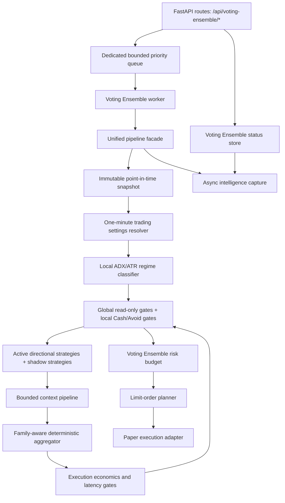

# Voting Ensemble Final Runtime Audit

Audit date: 2026-07-25

This document records the final Step 24 runtime audit for the isolated Voting Ensemble one-minute automation path. It describes what is wired today, where the runtime is intentionally shadow-only, and what remains blocked before any production-readiness claim.

Voting Ensemble must remain paper-only unless a later explicit change authorizes another execution mode.

## Architecture

## Event Flow

1. `POST /api/voting-ensemble/evaluate`, `/events/finalized-bars`, `/backtests`, `/replay`, `/settings-refresh`, and `/recovery-reconciliation` create Voting Ensemble runtime commands.
2. The API persists the queued command and returns `202 Accepted` with `jobId`, status URL, result URL, correlation ID, and idempotency key.
3. The dedicated priority queue admits high-priority one-minute paper/manual evaluation before lower-priority replay and backtest work.
4. The worker rejects stale commands, marks accepted commands running, and invokes the unified pipeline outside the request path.
5. The pipeline builds one immutable snapshot, resolves one-minute settings, runs the local regime classifier and gates, evaluates active and shadow modules, aggregates only active eligible directional signals, applies economics and latency gates, sizes risk, and creates an order plan.
6. Status transitions are persisted as `queued`, `running`, `completed`, `blocked`, `expired`, or `failed`.
7. Operational events and optional diagnostics are published to Voting Ensemble capture namespaces.

## Worker Lifecycle

The runtime boundary is `VotingEnsembleRuntimeOrchestrator`. It owns a `VotingEnsemblePriorityQueue`, `VotingEnsembleStatusStore`, `VotingEnsembleWorker`, and in-process worker adapter for tests.

The current application singleton auto-starts a background thread and reports `workerMode = separable_worker_process_contract`. This is a separable production contract, but not yet a separately deployed worker process in this repository.

Recovery behavior:

- Incomplete `queued` and `running` jobs are recoverable through `recover_incomplete_jobs` and the `recovery_reconciliation` command.
- Idempotency and symbol/bar/settings indexes prevent duplicate active evaluations for the same symbol, bar end timestamp, and settings hash.
- Backpressure returns a blocked runtime status instead of evaluating inline.
- Unknown execution state forces reconciliation and blocks additional entries for the affected symbol.

## Inventory

The authoritative inventory is `backend/app/algorithms/voting_ensemble/strategies/registry.py`. Runtime bindings are derived from inventory lifecycle state, and `/api/voting-ensemble/inventory/status` reports actual runtime bindings rather than a static ready response.

| Module ID | Collection | Lifecycle | Family | Runtime binding |
|---|---|---|---|---|
| multi_timeframe_trend_alignment | DIRECTIONAL | active | TREND | backend.app.algorithms.voting_ensemble.service:evaluate_multi_timeframe_trend |
| first_pullback_after_open | DIRECTIONAL | active | TREND | backend.app.algorithms.voting_ensemble.service:evaluate_first_pullback_after_open |
| failed_breakout_reversal | DIRECTIONAL | active | REVERSAL | backend.app.algorithms.voting_ensemble.service:evaluate_failed_breakout_strategy |
| liquidity_sweep_reversal | DIRECTIONAL | active | REVERSAL | backend.app.algorithms.voting_ensemble.service:evaluate_liquidity_sweep_reversal |
| bollinger_band_reversion | DIRECTIONAL | active | MEAN_REVERSION | backend.app.algorithms.voting_ensemble.service:evaluate_bollinger_band_reversion |
| atr_overextension_reversion | DIRECTIONAL | active | MEAN_REVERSION | backend.app.algorithms.voting_ensemble.service:evaluate_atr_overextension_reversion |
| opening_range_breakout | DIRECTIONAL | shadow | BREAKOUT | backend.app.algorithms.voting_ensemble.strategies.directional.opening_range_breakout:OpeningRangeBreakoutStrategy |
| vwap_trend_continuation | DIRECTIONAL | shadow | TREND | backend.app.algorithms.voting_ensemble.strategies.directional.vwap_trend_continuation:VwapTrendContinuationStrategy |
| gap_continuation_fade | DIRECTIONAL | shadow | GAP_SESSION | backend.app.algorithms.voting_ensemble.strategies.directional.gap_continuation_fade:GapContinuationFadeStrategy |
| relative_strength_qqq_iwm | CONTEXT | active | MARKET_CONTEXT | backend.app.algorithms.voting_ensemble.strategies.context.pipeline:RelativeStrengthQqqIwmSnapshotContext |
| market_breadth_momentum | CONTEXT | active | MARKET_CONTEXT | backend.app.algorithms.voting_ensemble.strategies.context.pipeline:MarketBreadthMomentumSnapshotContext |
| economic_event_context | CONTEXT | shadow | MARKET_CONTEXT | backend.app.algorithms.voting_ensemble.strategies.context.pipeline:EconomicEventSnapshotContext |
| market_structure_context | CONTEXT | shadow | MARKET_CONTEXT | backend.app.algorithms.voting_ensemble.strategies.context.pipeline:MarketStructureSnapshotContext |
| volume_confirmation_context | CONTEXT | shadow | MARKET_CONTEXT | backend.app.algorithms.voting_ensemble.strategies.context.pipeline:VolumeConfirmationSnapshotContext |
| vwap_position_context | CONTEXT | shadow | MARKET_CONTEXT | backend.app.algorithms.voting_ensemble.strategies.context.pipeline:VwapPositionSnapshotContext |
| adx_atr_regime_classifier | REGIME | active | MARKET_CONTEXT | backend.app.algorithms.voting_ensemble.strategies.regime.adx_atr_regime_classifier:AdxAtrRegimeClassifier |
| cash_avoid_trading_filter | SAFETY | active | SAFETY | backend.app.algorithms.voting_ensemble.gates:VotingEnsembleLocalGateEngine |
| ensemble_strategy_voting | AGGREGATOR | active | MARKET_CONTEXT | backend.app.algorithms.voting_ensemble.ensemble.family_aware:FamilyAwareDeterministicEnsemble.aggregate |
| trading_settings_resolver | TRADING_SETTINGS | active | SAFETY | backend.app.algorithms.voting_ensemble.trading_settings.resolver:resolve_one_minute_trading_settings |
| risk_budget | RISK_BUDGET | active | SAFETY | backend.app.algorithms.voting_ensemble.risk_budget:resolve_voting_ensemble_risk_budget |
| order_planner | ORDER_PLANNER | active | SAFETY | backend.app.algorithms.voting_ensemble.order_planner:VotingEnsembleOrderPlanner |
| execution_adapter | EXECUTION_ADAPTER | active | SAFETY | backend.app.algorithms.voting_ensemble.execution_adapter:VotingEnsembleExecutionAdapter |
| backtest_replay_adapter | BACKTEST_REPLAY_ADAPTER | active | MARKET_CONTEXT | backend.app.algorithms.voting_ensemble.backtesting_adapter:run_voting_ensemble_backtest |
| background_worker | BACKGROUND_WORKER | active | SAFETY | backend.app.algorithms.voting_ensemble.runtime.orchestrator:VotingEnsembleRuntimeOrchestrator |

## Active And Shadow Modules

Active directional families:

- Trend: Multi-Timeframe Trend Alignment, First Pullback After Open.
- Reversal: Failed Breakout Reversal, Liquidity Sweep Reversal.
- Mean reversion: Bollinger Band Reversion, ATR Overextension Reversion.

Shadow directional modules:

- Opening Range Breakout.
- VWAP Trend Continuation.
- Gap Continuation / Fade.

Active context modules:

- Relative Strength vs QQQ/IWM.
- Market Breadth Momentum.

Shadow context modules:

- Economic Event Context.
- Market Structure Context.
- Volume Confirmation Context.
- VWAP Position Context.

Shadow modules are evaluated and captured for analysis, but are not included in active directional aggregation, order direction, or quantity.

## Trading Settings Schema

Authoritative one-minute settings live under `backend/app/algorithms/voting_ensemble/trading_settings`. The legacy `settings.py` facade remains for compatibility.

The immutable resolved settings model includes:

- Algorithm ID, settings version, profile version, configuration hash, source baseline version, applied overlays, resolution timestamp, and reason codes.
- Strategy enablement, aggregation thresholds, family support, context bounds, session windows, event blackouts, data freshness, latency limits, spread/slippage limits, net-edge requirements, risk, daily loss, position/notional caps, trade limits, stop/target/holding policies, limit-order policy, cancel/replace policy, overlay limits, expense model, and paper execution mode.

Forbidden swing/hourly/daily/hybrid runtime keys are rejected by validation. Legacy values are exposed only through compatibility translation and are not the authoritative one-minute runtime model.

## Dynamic Profile Resolution

The profile resolver starts with the one-minute baseline and applies bounded overlays for regime, volatility, liquidity, spread, costs, event risk, data quality, market-data age, latency, time of day, drawdown, consecutive losses, exposure, family support, and vote edge.

Resolution is conservative:

- Risk and allocation use the smallest applicable cap.
- Entry thresholds use the strictest applicable value.
- Cost estimates use the largest applicable multiplier.
- Blocking overlays block new entries while preserving exit management.

Every resolved decision carries the resolved trading profile and settings hash.

## Gate Order

The service path applies gates in this order:

1. Snapshot and data health.
2. Read-only global hard gates.
3. Voting Ensemble operational safety.
4. Voting Ensemble regime and event permission.
5. Directional evaluation.
6. Family aggregation.
7. Cost and tradability gates.
8. Dynamic profile.
9. Risk sizing.
10. Order planning.
11. Execution submission through the paper adapter.

Gate decisions include blocked gate IDs and decision tracing so the blocking source is auditable.

## Strategy Families

- Trend: continuation evidence from aligned timeframes, first opening-session pullback, and shadow VWAP continuation.
- Breakout: shadow opening-range breakout only; not active until promotion evidence passes.
- Reversal: failed breakout and liquidity sweep reversal at reference levels.
- Mean reversion: Bollinger and ATR overextension reversion as separate implementations in the same family.
- Gap/session: shadow gap continuation/fade only; continuation and fade must be mutually exclusive.
- Market context: bounded contextual modifiers only; context never casts Buy or Sell votes.

## Cost Model

`execution_economics.py` calculates expected spread cost, slippage, fees, sell-side regulatory costs, market impact, total round-trip cost, predicted gross and net edge, edge-to-cost ratio, fillable quantity, participation rate, adverse-selection risk, and latency measurements.

Entries are blocked when quote age, data age, decision age, net edge, edge-to-cost ratio, spread, slippage, fillable quantity, or deadline constraints fail the resolved profile.

## Position Sizing Formula

`risk_budget.py` is authoritative. Final quantity is the minimum of:

- Risk-based shares: risk budget divided by stop distance.
- Position/notional cap shares.
- Available equity and buying-power shares.
- Liquidity-based shares.
- Participation-rate shares.
- Profile maximum shares.
- Read-only global exposure allowance.
- Voting Ensemble local exposure allowance.
- Order-allocation shares.

Quantity is zero for Hold candidates, failed gates, failed net edge, invalid stop distance, zero risk budget, below-minimum tradable quantity, or entry-blocking profiles. There is no hidden one-share fallback in the authoritative order path.

## Order Lifecycle

The execution adapter owns candidate-to-order translation, client order IDs, idempotency, limit and stop-limit policy, time in force, maximum order age, partial-fill handling, protective stops/targets, rejection handling, cooldowns, reconciliation, and Voting Ensemble order/trade state.

Normal entries are limit orders unless settings explicitly choose stop-limit. The adapter calls a shared paper broker client but keeps state in `voting_ensemble.execution_state`.

Lifecycle states include planned/submitted/accepted/rejected/partially filled/filled/canceled/expired/reconciliation required/blocked. Unknown order state requires reconciliation and blocks additional entries.

## Backtest Parity Contract

Paper worker, manual evaluation, replay, backtest, and shadow modes call the same pipeline facade and component order for the pre-execution decision and order plan.

Backtest-specific behavior is limited to historical event delivery, simulated clock, simulated broker/fills, deterministic latency/cost scenarios, and reporting. It must not use future outcomes, separate aggregation thresholds, fixed one-share sizing, or market-order shortcuts in the authoritative path.

## Promotion Policy

Lifecycle states are `unavailable`, `not_data_ready`, `shadow`, `candidate`, `active`, `disabled`, and `deprecated_alias`.

Shadow modules may become candidates only with evidence for focused tests, point-in-time replay, sample size, walk-forward stability, untouched holdout, cost stress, latency validity, overlap/concentration controls, and paper shadow stability.

Candidate modules may become active only through an explicit versioned inventory/configuration change. Opening Range Breakout, VWAP Trend Continuation, Gap Continuation/Fade, Economic Event Context, Market Structure Context, Volume Confirmation Context, and VWAP Position Context must not auto-activate.

## Failure And Recovery Behavior

- Missing, stale, malformed, or future-dated mandatory snapshot inputs fail closed.
- Partial one-minute bars are not processed as finalised evidence.
- Stale commands expire instead of evaluating.
- Bounded queue pressure blocks commands with an explicit status.
- Worker failures persist failed status and do not write another algorithm's state.
- Unknown broker state requires reconciliation and blocks new entries.
- Operational events are durable; optional analytical capture may drop newest records under documented overflow.

## Implementation Report

| Audit item | Status | Evidence |
|---|---|---|
| API requests enqueue background jobs | implemented | API routes persist/enqueue commands and return `202` with job URLs. |
| One-minute worker is authoritative | partially implemented | Worker owns evaluation path; production separability is a contract/thread adapter, not a separately deployed process here. |
| Inventory matches runtime | implemented | Inventory status compares active inventory IDs to runtime bindings. |
| Settings are Voting Ensemble-specific | implemented | Authoritative typed models live in `trading_settings`. |
| One-minute settings do not consume swing configuration | implemented | Forbidden runtime keys are rejected and legacy settings are compatibility-only. |
| Regime classifier is local and active | implemented | Local ADX/ATR classifier is active in inventory and service path. |
| Cash/Avoid and local gates are active | implemented | `VotingEnsembleLocalGateEngine` is active and called before and after aggregation/economics. |
| Family-aware engine is the sole aggregator | implemented | Service delegates aggregation to `FamilyAwareDeterministicEnsemble`. |
| Active strategies execute exactly once | implemented | Active directional runtime list is inventory-derived and validated by focused tests. |
| Shadow strategies cannot affect active output | implemented | Shadow outputs are evaluated/captured separately from active aggregation and sizing. |
| Context cannot vote | implemented | Context signals are converted to `HOLD` and bounded context effects. |
| Cost and latency gates are enforceable | implemented | Economics model feeds post-aggregation local gate checks. |
| Risk sizing is authoritative | implemented | Service uses `resolve_voting_ensemble_risk_budget`; order planner receives risk-budget quantity. |
| Limit-order planning is consistent across modes | implemented | Unified pipeline exposes the same pre-execution order plan across paper/replay/backtest. |
| Backtest/replay/paper parity tests pass | implemented | Focused Voting Ensemble parity tests pass; full repository status is listed below. |
| ML is not mandatory | implemented | ML defaults off/shadow and is not required for deterministic order eligibility. |
| State and persistence are isolated | partially implemented | VE namespaces are enforced in status, capture, and execution state; default persistence remains file/in-memory adapters. |
| Worker recovery is safe | implemented | Incomplete jobs recover/requeue and idempotency prevents duplicate evaluations. |
| Status endpoints report actual health | implemented | `/status`, `/runtime/status`, and `/inventory/status` report runtime and binding state. |
| All tests pass | blocked | Voting Ensemble suite passes; full backend suite still has unrelated/non-VE failures. |

Do not describe this implementation as production-ready until automatic-entry safety, worker recovery, cost and latency behavior, isolation, and paper stability have all passed in the full repository and paper-shadow evidence program.
