# Weighted Voting Current Implementation Inventory

Status: Phase 1 Step 1 inventory only. This document records current behavior and dependencies. It does not define the desired V2 design.

Primary implementation: `frontend/src/main.ts`

Current backend references are reporting, reconstruction, account-risk labeling, or forecast-derived score materialization. The authoritative Weighted Voting calculation is currently in the frontend.

## Strategy Catalog

`weightedAlphaStrategies` defines eight Weighted Voting strategies:

| Key | Name | Family |
| --- | --- | --- |
| `S1` | Opening Range Breakout | `breakout` |
| `S2` | First Pullback After Open | `trend` |
| `S3` | VWAP Trend Continuation | `trend` |
| `S4` | VWAP Mean Reversion | `reversion` |
| `S5` | Failed Breakout Reversal | `reversion` |
| `S6` | Liquidity Sweep Reversal | `reversion` |
| `S7` | Bollinger/ATR Reversion | `reversion` |
| `S8` | Volatility Breakout | `volatility` |

Related type and state objects:

| Symbol | Purpose |
| --- | --- |
| `WeightedAlphaKey` | Strategy key union `S1` through `S8`. |
| `WeightedAlphaStrategy` | Static strategy catalog row. |
| `WeightedAlphaResult` | Per-strategy probabilities, weights, performance, multipliers, and explanation. |
| `WeightedVotingWeightState` | Stored active weights plus update metadata. |
| `WeightedStrategyPerformance` | Stored trade counts, live outcomes, recent outcomes, drawdown, and pending signal. |
| `WeightedResolvedBarrierOutcome` | Target, stop, or time-barrier outcome for pending/backtest signals. |
| `WeightedTimeframeDirection` | `up`, `down`, or `neutral`. |
| `WeightedTimeframeSignal` | Higher-timeframe direction score and source text. |
| `WeightedTimeframeContext` | Current 5-minute confirmation context. |
| `WeightedTripleBarrierResult` | Decision-time triple-barrier filter result. |
| `WeightedInitialBacktestResult` | Bootstrap or daily refresh weights and performance. |
| `WeightedVoteResult` | Full panel result: final signal, raw winner, scores, gates, strategy rows, position size, and market data. |
| `WeightedSpyContextTimeframe` | `1Min` or `5Min` auxiliary SPY timeframe. |

## Frontend State And Storage

Local-storage keys:

| Key constant | Storage key | Contents |
| --- | --- | --- |
| `weightedTradingSettingsStorageKey` | `weighted-voting-trading-settings-v1` | Weighted trading settings. |
| `weightedTargetOrderOverridesStorageKey` | `weighted-voting-target-order-overrides-v1` | Manual target order field overrides. |
| `weightedVotingStorageKey` | `weighted-voting-daily-weights-short-cycle-v5` | Active strategy weights and update metadata. |
| `weightedStrategyPerformanceStorageKey` | `weighted-strategy-performance-short-cycle-v5` | Strategy performance and pending-signal tracking. |
| `WEIGHTED_TRADE_HISTORY_STORAGE_KEY` | `trading-dashboard.weighted-trade-history.v1` | Paper trade history for Weighted Voting. |
| `WEIGHTED_ORDER_CONTROL_MODES_STORAGE_KEY` | `trading-dashboard.weighted-order-control-modes.v1` | Per-lot manual/automatic controls. |
| `WEIGHTED_ORDER_CONTROL_OVERRIDES_STORAGE_KEY` | `trading-dashboard.weighted-order-control-overrides.v1` | Per-lot order-control overrides. |

Persistent UI state fields:

- `weightedVotingExpanded`
- `weightedDataExpanded`
- `weightedGatesExpanded`
- `weightedControlsExpanded`
- `weightedTradingSettingsExpanded`
- `weightedDefaultSizingExpanded`
- `selectedSellSetupByMode.weighted`
- `sellSetupSelectionLockedByMode.weighted`

Runtime state fields:

- `state.weightedMarketData`
- `state.weightedTradingSettings`
- `state.weightedTargetOrderOverrides`
- `state.currentWeightedTargetOrder`
- `state.weightedOrderControlModes`
- `state.weightedOrderControlOverrides`
- `state.weightedTradeHistory`

Module-level control state:

- `weightedTradingSettingsMountKey`
- `weightedMarketDataInFlight`
- `weightedInitialWeightsInFlight`

Constants:

- `WEIGHTED_BROWSER_BACKTEST_BOOTSTRAP_ENABLED = false`
- `weightedMinimumTradesForFullWeight = 40`
- `weightedVotingDefaultWeights = 0.125` for every strategy
- `weightedRelativeStrengthSymbols = ["QQQ", "IWM"]`
- `weightedSectorEtfSymbols = []`
- `weightedSpyBasketSampleSymbols = []`
- `weightedAuxiliarySymbols`
- `weightedSpyContextTimeframes = ["1Min", "5Min"]`

DOM bindings and panel controls:

- `weightedFinalSignal`
- `weightedScoreGrid`
- `weightedSummary`
- `weightedTradingSettingsMount`
- `weightedStrategiesToggle`
- `weightedStrategiesToggleMeta`
- `weightedStrategiesToggleIcon`
- `weightedStrategiesList`
- `weightedDataToggle`
- `weightedDataToggleMeta`
- `weightedDataToggleIcon`
- `weightedDataGrid`
- `weightedGatesToggle`
- `weightedGatesToggleMeta`
- `weightedGatesToggleIcon`
- `weightedGateList`
- `weightedControlsToggle`
- `weightedControlsToggleIcon`
- `weightedControlRules`
- `weightedTradingWindowTab`
- `algoWeightedVotingTabButton`
- `algoWeightedVotingPanel`

## Function Inventory

Storage and settings:

- `loadWeightedTradingSettings`
- `saveWeightedTradingSettings`
- `loadWeightedTargetOrderOverrides`
- `saveWeightedTargetOrderOverrides`
- `handleWeightedTradingSettingChange`
- `handleWeightedTargetSettingInput`
- `loadWeightedVotingWeightState`
- `saveWeightedVotingWeightState`
- `weightedVotingHasBacktestSeed`
- `loadWeightedStrategyPerformance`
- `defaultWeightedStrategyPerformance`
- `saveWeightedStrategyPerformance`
- `loadWeightedTradeHistory`
- `saveWeightedTradeHistory`
- `loadWeightedOrderControlModes`
- `saveWeightedOrderControlModes`
- `loadWeightedOrderControlOverrides`
- `saveWeightedOrderControlOverrides`

Market data and scheduling:

- `loadWeightedMarketData`
- `fetchWeightedSymbolCandles`
- `fetchWeightedTimeframeCandles`
- `latestWeightedOneMinuteCandle`
- `latestWeightedCalculationCandles`
- `ensureWeightedInitialWeightsFromBacktest`
- `fetchWeightedInitialBacktestCandles`
- `weightedInitialBacktestWeights`
- `weightedBacktestMarket`
- `runWeightedDailyBacktestRefresh`

Signal generation and market classification:

- `weightedAlphaSignal`
- `weightedMarketType`
- `weightedMarketRegime`
- `emptyWeightedTimeframeContext`
- `weightedTimeframeContext`
- `weightedDirectionalTimeframeSignal`
- `weightedSignalTimeframeAlignment`
- `weightedFiveMinuteConfirmationGate`
- `weightedStrengthComponents`
- `weightedFilterMultipliers`
- `weightedRelativeStrengthScore`
- `weightedBreadthScore`
- `weightedEventRiskScore`
- `scheduledEventRiskScore`
- `candleReturnOverLookback`
- `agreementScore`
- `marketBreadthProxy`

Weights, aggregation, and winner selection:

- `updateWeightedVotingPanel`
- `calculateWeightedVote`
- `emptyWeightedVote`
- `weightedWaitingGates`
- `normalizeWeightedValues`
- `capNormalizeWeights`
- `resolveWeightedVotingActiveWeights`
- `weightedVotingCanUpdateWeightsAfterClose`
- `weightedStrategyTradeCount`
- `weightedStrategyLiveOutcomeCount`
- `weightedStrategyRecentExpectancy`
- `weightedStrategyRecentDrawdown`
- `weightedStrategyDrawdownScore`
- `weightedStrategySampleSizeScore`
- `updateWeightedStrategyPerformanceFromSignals`
- `weightedDrawdownFromOutcomes`
- `weightedSignalSide`

Barrier, expected value, and pseudo-meta gate:

- `weightedSignalCostEstimate`
- `weightedBarrierSettings`
- `weightedTripleBarrierOutcome`
- `weightedResolvePendingSignalOutcome`
- `weightedTripleBarrierFilter`
- `emptyWeightedTripleBarrier`
- `weightedMetaLabelProbability`

Risk, gates, sizing, entry and exit logic:

- `weightedDailyLossStatus`
- `weightedDailyLossLimitDollars`
- `weightedDefaultSizingSettings`
- `weightedTodayPnl`
- `weightedTodayRealizedPnl`
- `weightedTodayOpenPnl`
- `weightedTargetOrderRecommendation`
- `weightedBlockedCandidateOrderLevels`
- `weightedTargetOrderFailedGates`
- `weightedAutomaticTargetSide`
- `weightedTargetSizing`
- `weightedTargetOrderGates`
- `weightedEntryQualityBlockedReason`
- `weightedAutomaticFiveMinuteConfirms`
- `weightedAutomaticEntryCushion`
- `weightedFragileEntryBlockedReason`
- `applyWeightedTargetOrderOverrides`
- `maybeAutoSubmitWeightedTargetOrder`

Rendering only:

- `renderWeightedStrategiesExpandedState`
- `renderWeightedDataExpandedState`
- `renderWeightedGatesExpandedState`
- `renderWeightedControlsExpandedState`
- `renderWeightedScoreGrid`
- `renderWeightedSummary`
- `renderWeightedStrategies`
- `renderWeightedMetricCell`
- `renderWeightedDataGrid`
- `renderWeightedGate`
- `renderWeightedControlRules`
- `updateWeightedTradingSettingsMount`
- `renderWeightedTradingSettingsPanel`
- `weightedTradingSettingsSummary`
- `renderWeightedTargetOrderSettings`
- `renderWeightedTargetSettingInput`
- `renderWeightedTargetSettingSelect`
- `renderWeightedDefaultSizingSection`
- `renderWeightedTradingSettingToggle`
- `renderWeightedTradingSettingInput`

Backend references:

- `backend/app/main.py::weighted_signal_from_scores`
- `backend/app/main.py::historical_meta_strategy_snapshot`
- `backend/app/main.py::buy_candidate_snapshot_reason`
- `backend/app/meta_strategy_training.py::reconstructed_weighted_voting`
- `backend/app/market_forecast.py::algorithm_signal_summary`
- `backend/app/gates/account_risk.py` includes `weighted_voting` as an account-risk algorithm id.
- `backend/tests/test_global_account_risk_state.py` covers the `weighted_voting` algorithm id.

## Current Calculation Flow

1. `updateWeightedVotingPanel` calls `calculateWeightedVote`.
2. `calculateWeightedVote` selects one-minute candles from `latestWeightedCalculationCandles`, falling back to chart candles.
3. It computes neutral indicators: closes, VWAP, ATR, Bollinger bands, opening range, prior high/low, average volume, SMA20, SMA50, relative strength, breadth, volatility percent, minutes, market regime labels, and 5-minute context.
4. It loads stored weights and strategy performance from local storage.
5. It runs `weightedAlphaSignal` once as preview, mutates performance with `updateWeightedStrategyPerformanceFromSignals`, then runs `weightedAlphaSignal` again.
6. It calculates base weights from signal strength, applies multipliers from `weightedFilterMultipliers`, normalizes/caps weights, smooths with stored weights, and may save daily weights after the close.
7. It aggregates `buyScore`, `sellScore`, and `holdScore` as `sum(finalWeight * pSide)`.
8. It selects `rawWinner` as the highest score and `margin` as first minus second.
9. It evaluates gates.
10. Any failed gate changes the displayed `signal` to `Hold`, while `rawWinner` is preserved in the result.
11. It calculates a position-size estimate and a manual/automatic target order recommendation.
12. `maybeAutoSubmitWeightedTargetOrder` may append a paper trade-history row if submit mode is Automatic and all checks pass.

## Gates

`calculateWeightedVote` produces these gates:

- Confidence
- Active Strategies
- Directional Strategy Count
- 5m Confirmation
- Expected Value
- Meta Label
- Triple Barrier
- Daily Loss
- Spread/Slippage
- 1m Volume
- Max Daily Trades
- Pyramiding

`weightedTargetOrderFailedGates` adds order-specific blockers for automatic mode:

- Weighted Decision
- Weighted Late-session Buy Guard
- Weighted Forecast Safety
- Short-cycle VWAP

`weightedTargetSizing` adds sizing and entry-quality blockers:

- score total zero
- side not winner
- active strategy count
- directional strategy count
- minimum side score
- signal edge
- spread
- volume
- ATR too low or high
- VWAP entry quality
- fragile 1-minute entry
- daily realized P&L loss limit
- max trades today
- pyramiding
- available buying power
- participation cap
- max allowed shares

## Trading Settings And Position Sizing

Trading settings are frontend-local under `weighted-voting-trading-settings-v1`.

`weightedDefaultSizingSettings` derives current thresholds from `state.weightedTradingSettings`. When `useDefaultSizingSettings` is false, it falls back to hard-coded defaults plus user order sizing fields. When it is true, it clamps and rounds the versionless frontend settings.

Current configurable fields surfaced by the Weighted Voting UI include:

- `startingCapital`
- `orderAllocationPercent`
- `dailyAllocationPercent`
- `riskBudgetPercentOfOrder`
- `maxTradesPerDay`
- `fixedStopDistanceDollars`
- `stopLossPercent`
- `takeProfitR`
- `slippagePerShare`
- `useDefaultSizingSettings`
- `minimumBuyScore`
- `minimumSignalEdge`
- `baseRiskPercent`
- `maxPositionPercent`
- `atrStopMultiplier`
- `minimumStopDistancePercent`
- `maxParticipationPercent`
- `minimumOneMinuteVolume`
- `maxAllowedShares`
- `maxDailyLossPercent`
- `pyramidingEnabled`

`weightedTargetSizing` calculates:

- account equity from settings
- bid/ask from latest close and slippage
- current Weighted position from paper trade history
- maximum position dollars
- maximum order dollars
- daily buying power
- stop distance
- risk dollars
- risk-based shares
- order-based shares
- capital-based shares
- buying-power shares
- liquidity/participation shares
- final quantity

## Automatic Submission And Manual Recommendations

Current automatic submission is not broker submission. It appends to local paper trade history by calling `appendTradeHistory` from `maybeAutoSubmitWeightedTargetOrder`.

The automatic path requires:

- `state.currentWeightedTargetOrder`
- `submitMode === "Automatic"`
- `canSubmitTrades()`
- `order.side === "Buy"`
- no existing automatic trade for the same candle
- a valid execution price
- paper position and quantity checks
- no automatic order rejection
- a unique automatic order key

Manual order recommendations are created by `weightedTargetOrderRecommendation` and rendered in the Weighted Trading Settings panel. They include order type, side, quantity, trigger, limit, protective stop, target, risk, slippage estimate, time in force, cutoff, failed gates, and summary.

Exit logic is indirect and shared: open lots, realized P&L, and position summaries use shared trade-history helpers keyed by mode `weighted`. There is no isolated Weighted backend exit engine in the current implementation.

## API Calls

Weighted-specific frontend fetches:

- `fetchWeightedSymbolCandles` calls `GET ${API_BASE}/api/candles` for QQQ/IWM 1-minute candles.
- `fetchWeightedTimeframeCandles` calls `GET ${API_BASE}/api/candles` for SPY `1Min` and `5Min`.
- `fetchWeightedInitialBacktestCandles` first calls `GET ${API_BASE}/api/backtest-data/candles`, then falls back to `fetchAlgoBacktestCandles("1Min")`.

Shared daily refresh calls that feed Weighted refresh:

- `ensureBacktestDatasetThrough`
- `waitForDailyBacktestArtifacts`
- `fetchPreparedBacktestCandles("1Min")`

There is no dedicated backend Weighted Voting calculation endpoint in the current implementation.

## Cross-Algorithm And ML Dependencies

These are current dependencies to remove or isolate during V2 work:

| Location | Dependency | Current effect |
| --- | --- | --- |
| `weightedMetaLabelProbability` | `state.dynamicArtifact?.mlComparison?.bestByTimeframe` and `state.mlComparison?.bestByTimeframe` | Uses ML comparison/dynamic-artifact verdicts to set the "Meta Label" gate probability. |
| `weightedRelativeStrengthScore` | `marketBreadthProxy` fallback | If QQQ/IWM are unavailable, falls back to Voting Ensemble style strategy vote breadth. |
| `weightedBreadthScore` | `marketBreadthProxy` fallback | If auxiliary breadth data are unavailable, falls back to Voting Ensemble directional proxy. |
| `marketBreadthProxy` | `strategyEnsembleSignals(state.marketContext)` and `isEligibleStrategyVote` | Reads Voting Ensemble signal helpers and market-context state. |
| `weightedEventRiskScore` | `state.marketContext`, macro events, Fed events | Reads event/context state. This function is present but `calculateWeightedVote` currently hard-codes `eventRisk = 0`. |
| `weightedTargetOrderFailedGates` | `lateSessionAboveAverageBuyBlocker` | Uses shared late-session guard. |
| `weightedTargetOrderFailedGates` | `forecastBuySafetyBlockers` | Uses forecast safety blockers for automatic Buy. |
| `historical_meta_strategy_snapshot` | Forecast `algorithmSignals.weightedScores` | Backend meta snapshot reconstructs Weighted fields from forecast output. |
| `buy_candidate_snapshot_reason` | Forecast `algorithmSignals.weightedScores` | Backend meta backfill uses weighted buy/sell scores as one candidate sampler feature. |
| `reconstructed_weighted_voting` | Training rows containing weighted strategy outputs or family scores | Meta training reconstructs a weighted baseline from snapshot data. |
| `algorithm_signal_summary` | Forecast features under `algorithm.weighted_*` | Forecast output exposes weighted-score fields. |

Trading RAG dependency:

- No direct Weighted Voting function calls Trading RAG.
- Daily backtest refresh runs `runVotingEnsembleDailyBacktestRefresh`, which loads Trading RAG, in the same `Promise.allSettled` group as `runWeightedDailyBacktestRefresh`.

Dynamic artifact dependency:

- Direct through `weightedMetaLabelProbability`.
- Daily refresh waits for dynamic artifacts before running Weighted daily refresh.

Future Market Prediction or forecast dependency:

- Direct in automatic order gating through `forecastBuySafetyBlockers`.
- Backend forecast output exposes weighted score summaries.
- `activateAppAfterWake` starts forecast ledger and dynamic artifact loading before `loadCandles`, which then refreshes Weighted market data.

## Shared Global Checks

Current shared checks used by Weighted Voting include:

- `canSubmitTrades`
- `automaticTradeAlreadySubmittedForCandle`
- `targetOrderExecutionPrice`
- `summarizePositionFromTradeHistory`
- `automaticOrderQuantity`
- `automaticOrderRejectionReason`
- `automaticOrderKeyForMode`
- `rememberAutoSubmittedOrderKey`
- `appendTradeHistory`
- `openOrderLots`
- `effectiveTodaysTradeCount`
- `dailyTradeCountDetail`
- `todayRealizedPnlForMode`
- `latestExecutionCandleForMode`
- `lateSessionAboveAverageBuyBlocker`
- `forecastBuySafetyBlockers`
- `defaultSizingStopDistance`
- `fixedStopDistanceDollars`
- `targetProfitDistancePerShare`
- `latestManualSpreadPercent`
- `roundNumber`, `roundNumberUp`, `clampNumber`, `formatProbability`, `formatBasisPoints`, `currency`, `signedCurrency`, `price`
- `sessionVwapValue`, `averageTrueRange`, `bollingerBands`, `openingRangeValues`, `simpleMovingAverage`
- `easternMinutes`, `easternDateString`, `isRegularSession`, `latestRegularSessionCandlesFrom`

## Dependency Graph

```mermaid
graph TD
  A["updateWeightedVotingPanel"] --> B["calculateWeightedVote"]
  A --> C["renderWeighted* UI"]
  A --> D["updateWeightedTradingSettingsMount"]
  A --> E["maybeAutoSubmitWeightedTargetOrder"]

  B --> F["latestWeightedCalculationCandles"]
  B --> G["neutral indicator helpers"]
  B --> H["weightedRelativeStrengthScore"]
  B --> I["weightedBreadthScore"]
  B --> J["weightedMarketRegime"]
  B --> K["weightedTimeframeContext"]
  B --> L["loadWeightedVotingWeightState"]
  B --> M["weightedAlphaSignal x 8"]
  B --> N["updateWeightedStrategyPerformanceFromSignals"]
  B --> O["weightedFilterMultipliers"]
  B --> P["normalizeWeightedValues/capNormalizeWeights"]
  B --> Q["resolveWeightedVotingActiveWeights"]
  B --> R["weightedTripleBarrierFilter"]
  B --> S["weightedMetaLabelProbability"]
  B --> T["weightedDailyLossStatus"]
  B --> U["effectiveTodaysTradeCount/openOrderLots"]

  H --> V["QQQ/IWM weightedMarketData"]
  H --> W["marketBreadthProxy fallback"]
  I --> V
  I --> W
  W --> X["strategyEnsembleSignals"]
  W --> Y["isEligibleStrategyVote"]
  W --> Z["state.marketContext"]

  S --> AA["state.dynamicArtifact.mlComparison"]
  S --> AB["state.mlComparison"]

  D --> AC["weightedTargetOrderRecommendation"]
  AC --> AD["weightedTargetSizing"]
  AC --> AE["weightedTargetOrderFailedGates"]
  AC --> AF["applyWeightedTargetOrderOverrides"]
  AE --> AG["lateSessionAboveAverageBuyBlocker"]
  AE --> AH["forecastBuySafetyBlockers"]
  AD --> AI["summarizePositionFromTradeHistory/openOrderLots"]

  E --> AJ["canSubmitTrades"]
  E --> AK["appendTradeHistory mode=weighted"]

  AL["loadCandles/scheduleAutoRefresh"] --> AM["loadWeightedMarketData"]
  AM --> AN["GET /api/candles"]
  AO["maybeRunDailyAlgorithmBacktests"] --> AP["runWeightedDailyBacktestRefresh"]
  AP --> AQ["weightedInitialBacktestWeights"]
  AQ --> M
```

## Characterization Fixtures

Fixtures live at `backend/tests/fixtures/weighted_voting_current_behavior.json`.

The fixtures freeze post-signal current behavior for:

- trending session
- range-bound session
- high-volatility session
- low-volume session
- wide-spread session
- Buy result
- Sell result
- Hold result

They are intentionally not a new runtime implementation. Each fixture records strategy rows, gate statuses, and expected current output so the current score aggregation and winner selection can be reproduced from fixed inputs.

## Current Limitations Found During Inventory

- Authoritative trading logic is currently in `frontend/src/main.ts`, not the backend.
- Weighted Voting currently reads ML/dynamic-artifact comparison state through `weightedMetaLabelProbability`.
- Weighted Voting currently falls back to Voting Ensemble style signal proxies when auxiliary breadth or relative-strength data are missing.
- Automatic order gating can read forecast safety blockers.
- Settings are stored as versionless frontend local-storage objects rather than backend versioned configuration objects.
- Current snapshots and meta-training utilities can consume or reconstruct Weighted Voting fields, which must remain reporting/comparison only in V2.
- Some decision-time behavior mutates performance storage during calculation through `updateWeightedStrategyPerformanceFromSignals`.
- The current implementation can use same-session future candles to resolve pending signal outcomes for performance tracking after a later candle arrives; that tracking must remain separate from decision-time features in V2.
